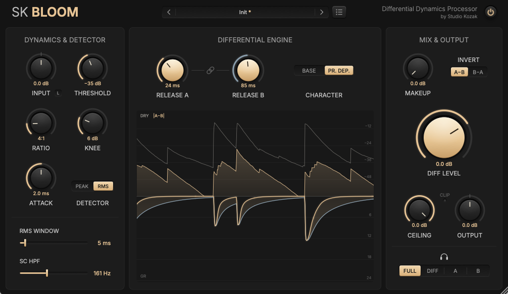
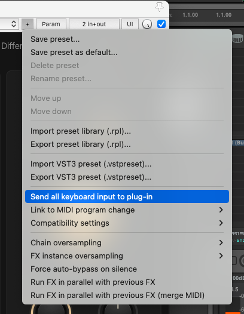

<p align="center">
  
</p>

<h1 align="center">SK Bloom</h1>

<p align="center">
  <em>Two compressors disagree. Your snare gets the difference.</em>
</p>

<p align="center">
  
</p>

<p align="center">
  <strong>
    <a href="https://github.com/studiokozak/SK-Bloom/releases/latest">
      Download Latest Release
    </a>
  </strong>
</p>

---

## Overview

SK Bloom does something a little stranger.
It runs two identical compressors side by side. One lets go of the sound quickly after each hit. The other lets go slowly. SK Bloom throws away everything they agree on and keeps only what separates them.
That difference lives in a very specific place: just after the hit, in the tail of the sound. The attack goes through untouched. Blend the difference back in, and the body of a snare, a tom or a kick grows longer and fuller, as if the room had opened up a little.
Set both compressors to let go at the same speed and they agree perfectly. The difference is silence.

This is SK Bloom, a differential dynamics processor.

---

## Features

* Adds body and sustain without touching the attack
* Two compressors that differ only by their release time
* Two release behaviours: steady or program-dependent
* Real-time display of the last two seconds, bloom included
* Listen modes to hear the bloom on its own
* Sidechain high-pass filter
* Soft output ceiling, 4× oversampled
* Input/Output linked gain staging
* Built-in preset manager with folders
* Mono and stereo
* VST3 (Windows & macOS)
* Audio Unit (macOS)
* Intel & Apple Silicon support

---

## Controls

The interface is split into three sections, from left to right: what the compressors listen to, how the bloom is made, and how it is mixed back in.

---

### DYNAMICS & DETECTOR

This section decides when the compressors react. Both compressors share it, so whatever you set here applies to A and B alike.

#### INPUT

Sets the level entering SK Bloom. Pushing it makes the compressors react more, much like lowering the threshold.

#### INPUT/OUTPUT LINK

Links INPUT and OUTPUT. When enabled, raising the input automatically lowers the output by the same amount, so you can drive the compressors harder without the overall level jumping around.

#### THRESHOLD

The level above which the compressors start working. Lower it and more of your sound triggers the effect, including quieter hits.

#### RATIO

How firmly the compressors hold the sound down once it crosses the threshold. Higher ratios give a stronger, more obvious bloom.

#### KNEE

How gently the compressors start working as the sound approaches the threshold. Low values are abrupt, higher values ease in smoothly.

#### ATTACK

How quickly the compressors grab the sound after a hit. Very short settings catch the very first instant. Longer settings let more of the initial snap through before anything happens, and move the start of the bloom slightly later.

#### DETECTOR (PEAK / RMS)

PEAK reacts to every short spike. RMS reacts to the average loudness, which feels smoother and less nervous.

#### RMS WINDOW

How long the RMS detector averages the sound. Short values stay close to PEAK, long values get lazier. Only active in RMS mode.

#### SC HPF

Makes the compressors ignore low frequencies when deciding how hard to work. Useful when a kick or a bass keeps triggering the effect on its own. It only changes what the compressors *listen to*, never what you *hear*. Set below 20 Hz, it is off.

---

### DIFFERENTIAL ENGINE

This is where the bloom is made.

#### RELEASE A / RELEASE B

How quickly each compressor lets go after a hit.
The gap between the two values is the bloom. The further apart they are, the longer the tail you add. Keep Release A shorter than Release B for the classic effect: compressor A recovers first, and the moment where A has let go while B is still holding is exactly the body of your sound.
Set them to the same value and the bloom disappears completely.
The link button between the two knobs keeps the ratio between them while you turn either one. Handy for making the tail longer or shorter while keeping its shape.

#### CHARACTER (BASE / PR. DEP.)

BASE gives a steady, predictable recovery. Same behaviour on every hit.
PR. DEP. (program-dependent) lets the recovery adapt to the music: quick after short hits, slower after long or loud passages. It usually sounds more natural and more alive.

#### Display

Shows the last two seconds of audio. On top, the level of your original sound and the amount of bloom being generated. Below, how much each compressor is pushing down. The filled area between the two curves is the bloom itself, literally.

---

### MIX & OUTPUT

#### MAKEUP

Raises the level of both compressors, which makes the bloom louder. Your original sound is not affected.

#### INVERT (A−B / B−A)

Flips the bloom upside down. In the normal position it adds body. Inverted, it removes body instead, making the sound shorter and tighter. A quick way to tame a boomy drum.

#### DIFF LEVEL

How much bloom is added to your original sound. Maybe the knob you will touch the most.

#### CEILING

A safety limit at the very end of the chain: your sound will not go above the level you set here. Instead of clipping harshly as it gets close, it gently rounds off the loudest peaks. The clip light shows when it is working.

#### OUTPUT

Sets the final output level.

#### LISTEN (FULL / DIFF / A / B)

FULL is the normal mode: your sound plus the bloom.
DIFF plays the bloom alone, so you can hear exactly what you are adding. The best way to set the release times.
A and B play each compressor on its own. In other words, SK Bloom can also be used as a plain compressor. A and B are the exact same compressor. So the real question is not which compressor to pick, but which letter you like best. Either will happily do the job, though using only one is a bit like booking a duo and asking for a solo. :)

---

### Presets

Click the preset name in the header to open the preset panel. Save your settings, name them, rename them and sort them into folders.
There are no factory presets, only Init. Every source is different, and the right settings depend on yours.

**Reaper users:** by default, Reaper keeps keyboard shortcuts for itself. Press the space bar while naming a preset and your song starts playing instead of a space being typed. To fix this, click the + button at the top of the plugin window and enable Send all keyboard input to plug-in. Keep in mind that while this option is on and the plugin window has focus, the space bar will not start or stop playback, so you may want to switch it back off once your presets are named.

<p align="center">
  
</p>

---

### Power

The button in the header engages or bypasses the processing.

---

## Philosophy

SK Bloom started with a simple question: what happens between the moment one compressor lets go and the moment another one does?
The answer turned out to be music.
You do not need to understand compression to use it. Start from Init. Play with the two releases until the tail sounds right on its own.
Then tweak.
Listen.
Tweak again.
Trust your ears.

---

## Typical Applications

SK Bloom may work particularly well on:

* Snare drums
* Toms
* Kick drums
* Hand percussion
* Drum buses
* Plucked instruments
* Bass

And, inverted, on drums that ring a little too long.

---

## System Requirements

### Windows

* Windows 10 or later
* VST3 compatible host
* VST3 format

### macOS

* macOS 11 Big Sur or later
* Intel or Apple Silicon
* VST3 and Audio Unit (AU) formats
* Compatible VST3 or Audio Unit host

---

## Installation

### Windows

Copy:

`SK Bloom.vst3`

to:

`C:\Program Files\Common Files\VST3`

Then restart your DAW.

### macOS

#### VST3 Version

Copy:

`SK Bloom.vst3`

to:

`/Library/Audio/Plug-Ins/VST3`

#### Audio Unit Version

Copy:

`SK Bloom.component`

to:

`/Library/Audio/Plug-Ins/Components`

Then restart your DAW.

---

### macOS Security

SK Bloom is built as a Universal Binary and supports both Intel and Apple Silicon Macs.
Depending on your macOS security settings, you may need to authorize the plugin manually the first time it is loaded, from System Settings > Privacy & Security.

If your DAW still refuses to load it, open Terminal and run:

```
xattr -dr com.apple.quarantine "/Library/Audio/Plug-Ins/VST3/SK Bloom.vst3"
xattr -dr com.apple.quarantine "/Library/Audio/Plug-Ins/Components/SK Bloom.component"
```

---

## Notes

SK Bloom is not a transient shaper, not a reverb and not quite a compressor either. It does one thing: it finds the part of a sound that lives just after the hit, and lets you turn it up or down.
It is an experiment that worked better than expected.
Like most good experiments, it is best used with curiosity.

---

Hope you enjoy SK Bloom.

*Stéphan (Studio Kozak)*
